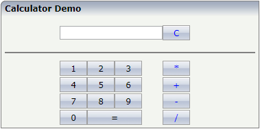

##### Thomas Schwade - September 26, 2017

## Testing a Natural Ajax application with Cucumber

### Why Cucumber?

Automatic testing is another essential building block in the DevOps concept. A well known and widely used tool for automatic testing of web applications  is Selenium. While it can be nicely used also to test with Natural Ajax applications, it is not the ideal tool for acceptance tests. Why? If we use Selenium stand-alone, there is no separation between specifying a test and implementing a test. Specifying a test scenario should be done from a business perspective and should not require programming skills. Implementing a test on the other hand can be done by developers and will require some programming skills.

Cucumber enforces this separation. The specification of a test scenario can be done nearly in natural language. Only the implementation of a test scenario requires programming, but the effort can be heavily reduced by a powerful API and by test code reusage.

But let us look at a practical example.

### What do we want to achieve?

We want to test the Calculator application contained in the Natural Ajax demo library:

Using Cucumber, we specify our test scenarios as follows:

	Feature: Calculator application

		Scenario: Multiplication

		    Given the Calculator application is running
    		And I press the 2 key
    		And I press the 3 key
    		And I press the multiplication key
    		And I press the 5 key
    		And I press the equals key
    		Then the result field should contain 115

		Scenario: Division

    		Given the Calculator application is running
    		And I press the 2 key
    		And I press the 5 key
    		And I press the 6 key
    		And I press the division key
    		And I press the 3 key
    		And I press the 2 key
    		And I press the equals key
    		Then the result field should contain 8

This test scenario can be written without programming skill and without knowledge of the technical structure of the web page under test.

Cucumber generates from this test specification a skeleton for the implementation of the test.

	Given(/^the Calculator application is running$/) do
  		pending # Write code here that turns the phrase above into concrete actions
	end

	Given(/^I press the (\d+) key$/) do |arg1|
  		pending # Write code here that turns the phrase above into concrete actions
	end

	Given(/^I press the multiplication key$/) do
  		pending # Write code here that turns the phrase above into concrete actions
	end

	Given(/^I press the equals key$/) do
  		pending # Write code here that turns the phrase above into concrete actions
	end

	Then(/^the result field should contain (\d+)$/) do |arg1|
  		pending # Write code here that turns the phrase above into concrete actions
	end

	Given(/^I press the division key$/) do
  		pending # Write code here that turns the phrase above into concrete actions
	end

This skeleton is then filled with "flesh" by a developer. This can be done with few code lines with a high level API to the web page like Capybara. Once this has been done, the test specification can be executed right away:

	Feature: Calculator application

	Scenario: Multiplication                      # features/calculator.feature:3
    Given the Calculator application is running # features/step_definitions/calculator_steps.rb:8
    And I press the 2 key                       # features/step_definitions/calculator_steps.rb:15
    And I press the 3 key                       # features/step_definitions/calculator_steps.rb:15
    And I press the multiplication key          # features/step_definitions/calculator_steps.rb:21
    And I press the 5 key                       # features/step_definitions/calculator_steps.rb:15
    And I press the equals key                  # features/step_definitions/calculator_steps.rb:33
    Then the result field should contain 115    # features/step_definitions/calculator_steps.rb:39
	
	Scenario: Division                            # features/calculator.feature:13
    Given the Calculator application is running # features/step_definitions/calculator_steps.rb:8
    And I press the 2 key                       # features/step_definitions/calculator_steps.rb:15
    And I press the 5 key                       # features/step_definitions/calculator_steps.rb:15
    And I press the 6 key                       # features/step_definitions/calculator_steps.rb:15
    And I press the division key                # features/step_definitions/calculator_steps.rb:27
    And I press the 3 key                       # features/step_definitions/calculator_steps.rb:15
    And I press the 2 key                       # features/step_definitions/calculator_steps.rb:15
    And I press the equals key                  # features/step_definitions/calculator_steps.rb:33
    Then the result field should contain 8      # features/step_definitions/calculator_steps.rb:39

	2 scenarios (2 passed)
	16 steps (16 passed)
	0m10.182s

### What do we need?

We use a stack of four tools:

- Cucumber: Allows us to specify and execute tests scenarios in nearly natural language.
- Capybara: A high level API to access web pages.
- PhantomJS: A headless browser based on webkit under which the test is executed.
- poltergeist: A Capybara driver for PhantomJS.

### A playground for the first steps

Installing the required components is a tedious task, therefore I have prepared a Dockerfile that you can use to build a container with the full tool stack.

First of all we need a machine where Docker is installed. For this example I used an Oracle VirtualBox VM, running Ubuntu 16.04. On this VM I installed Docker as described in https://docs.docker.com/engine/installation/linux/ubuntu/

To run the tests, you should have the Natural Ajax Demo application configured in the following way:

- Have a session named Calculator in your sessions.xml that is preset with user ID and password of a test user.
- In the session definition, start the Calculator application with STACK=(LOGON NJXDEMO;CALCUL-P)
- Make sure that framebuffersize="1" is set in cisconfig.xml.

Adapt the URL in calculator_steps.rb to the Calculator application in your environment.

Then build the container with:

	sudo docker build -t mycucumber .

Run the tests with:

	sudo docker run -it mycucumber cucumber

and you should receive the above shown test results.